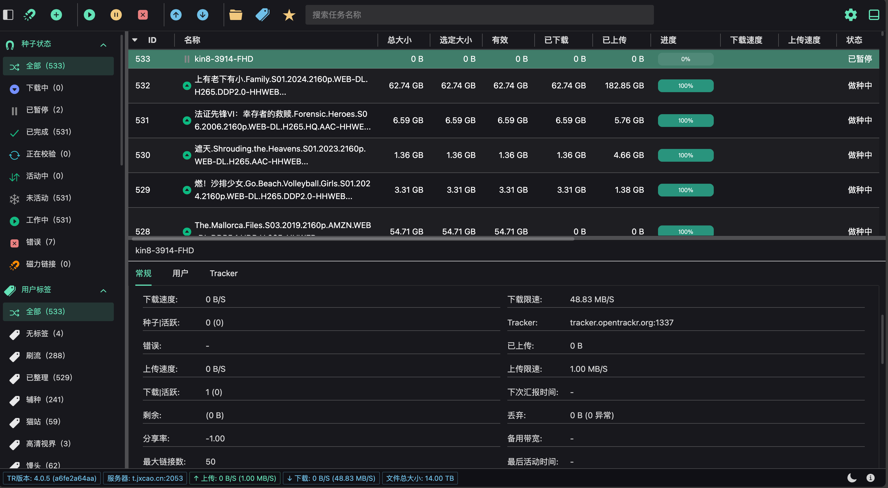
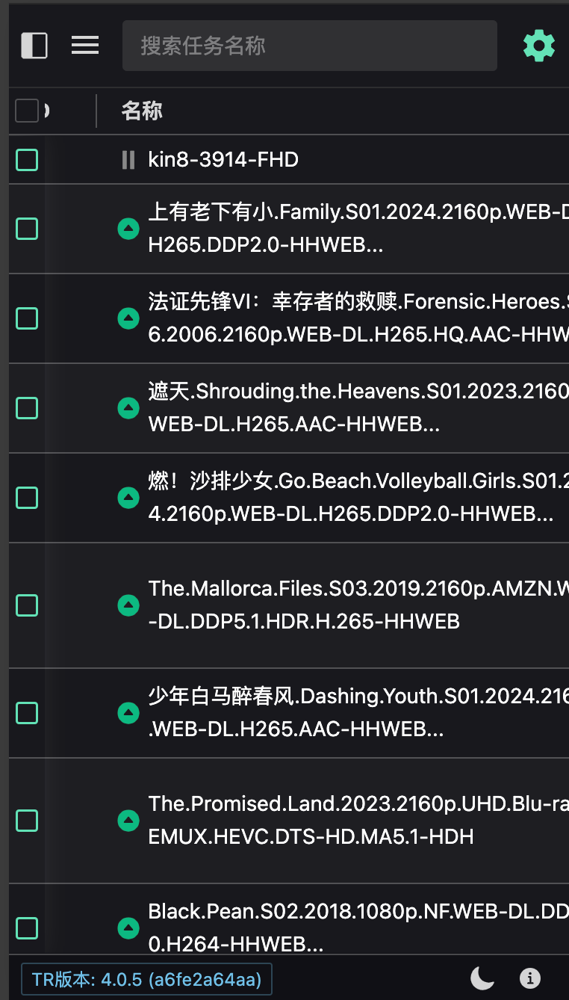
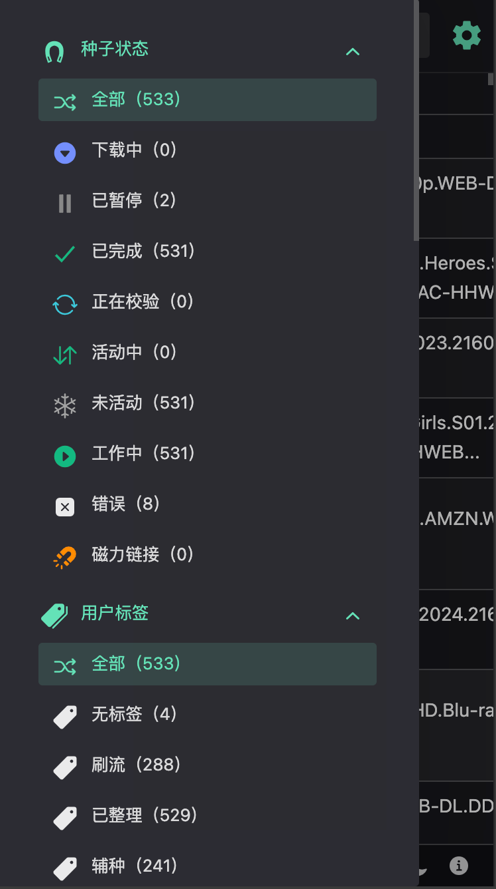
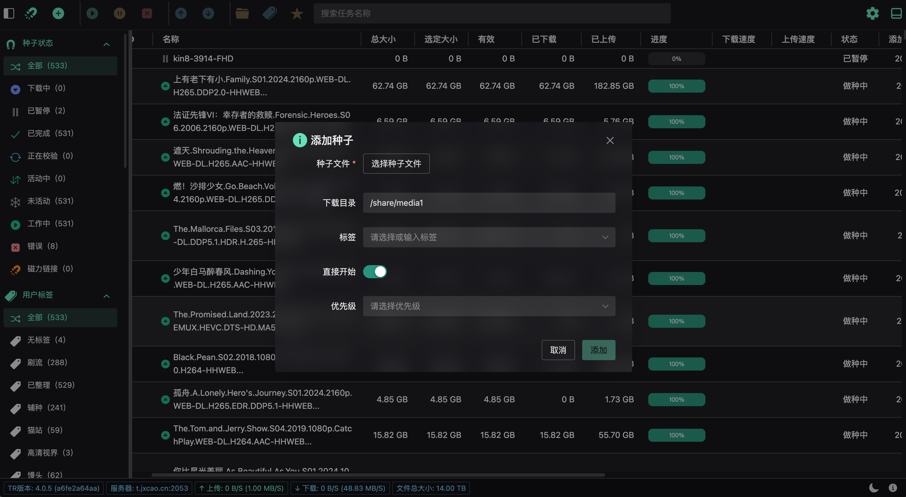

# Transmission Web

<div align="center">
  

  <h3>🚀 现代化的 Transmission BitTorrent 客户端 Web 界面</h3>

  <p>基于 Vue 3 + TypeScript 构建的高性能 BitTorrent 管理界面</p>

  [](https://choosealicense.com/licenses/mit/)
  [](https://vuejs.org/)
  [](https://www.typescriptlang.org/)
  [](https://www.naiveui.com/)
</div>

## 📖 项目简介

Transmission Web 是一个现代化的 Transmission BitTorrent 客户端 Web 界面，采用最新的前端技术栈重新设计开发。提供了简洁美观的用户界面、丰富的功能特性和优秀的用户体验。

### ✨ 主要特性

- 🎨 **现代化界面** - 基于 Naive UI 设计系统，支持亮色/暗色主题
- 📱 **响应式设计** - 完美适配桌面端和移动端设备
- ⚡ **高性能** - (canvas)虚拟滚动技术，轻松处理大量种子列表
- 🔍 **智能过滤** - 支持状态、标签、站点、错误状态等多维度过滤
- 📊 **数据可视化** - 丰富的进度条、统计图表和状态指示器
- 🎯 **便捷操作** - 支持批量操作、拖拽排序、快捷键等
- 🌐 **国际化** - 多语言支持（计划中）
- 🔧 **可定制** - 灵活的列配置、布局调整等个性化设置

### 🚀 功能亮点

#### 种子管理
- ✅ 添加种子文件或磁力链接
- ✅ 暂停/继续/删除种子
- ✅ 修改种子优先级
- ✅ 更改下载路径
- ✅ 编辑种子标签
- ✅ 修改 Tracker 信息

#### 界面特性
- ✅ 可拖拽调整的侧边栏
- ✅ 自定义表格列显示
- ✅ 虚拟滚动优化大数据性能
- ✅ 右键上下文菜单
- ✅ 移动端长按操作支持

#### 数据展示
- ✅ 实时下载/上传速度
- ✅ 种子完成进度
- ✅ 连接用户数统计
- ✅ 错误状态提示
- ✅ 详细的种子信息

## 🛠️ 技术栈

- **框架**: Vue 3 (Composition API)
- **语言**: TypeScript
- **构建工具**: Vite
- **UI 组件库**: Naive UI
- **样式方案**: Tailwind CSS + UnoCSS + Less
- **状态管理**: Pinia
- **路由**: Vue Router
- **HTTP 客户端**: Axios
- **虚拟滚动**: Vue Virtual Scroller
- **工具库**: VueUse, Day.js, Lodash


## 🐳 Docker 部署

项目提供了 Docker 支持，可以快速部署到任何支持 Docker 的环境。

### 构建镜像

```bash
docker build -t transmission-web .
```

### 运行容器

```bash
docker run -d -p 7632:7632 jianxcao/transmission-web
```
### 运行容器 docker-compose
``` bash
services:
  tr-web:
    image: jianxcao/transmission-web
    container_name: tr-web
    environment:
      - BACKEND_URL=http://192.168.50.23:9091
    ports:
      - "7632:7632"
    restart: unless-stopped
```


## 配置transmission docker 运行
-  下载 [release](https://github.com/jianxcao/transmission-web/releases) 页面下的压缩包 **transmission-web-*.zip**
-  解压内容到服务器的目录（tr 容器需可以访问该目录）
-  配置 env TRANSMISSION_WEB_HOME为解压的目录


## 界面预览





## 📦 安装与运行

### 环境要求

- Node.js >= 18.0.0
- pnpm >= 8.0.0 (推荐)

### 克隆项目

```bash
git clone https://github.com/jianxcao/transmission-web.git
cd transmission-web
```

### 安装依赖

```bash
# 使用 pnpm (推荐)
pnpm install

# 或使用 npm
npm install

# 或使用 yarn
yarn install
```

### 开发环境运行

```bash
pnpm dev
```

访问 http://localhost:5173

### 生产环境构建

```bash
pnpm build
```


## 📁 项目结构

```
src/
├── api/              # API 接口
├── assets/           # 静态资源
├── components/       # 可复用组件
│   ├── AppHeader/    # 应用头部
│   ├── CanvasList/   # 画布列表 (主要列表组件)
│   ├── TorrentList/  # 种子列表
│   ├── SiderbarView/ # 侧边栏
│   └── dialog/       # 对话框组件
├── composables/      # 组合式函数
├── store/            # Pinia 状态管理
├── utils/            # 工具函数
├── views/            # 页面组件
└── types/            # TypeScript 类型定义
```

## 🤝 参与贡献

我们欢迎各种形式的贡献，包括但不限于：

- 🐛 Bug 报告
- 💡 功能建议
- 📝 文档改进
- 🔧 代码贡献

### 开发规范

- 使用 Vue 3 Composition API
- 遵循 TypeScript 最佳实践
- 使用 ESLint + Prettier 进行代码格式化
- 提交信息遵循 Conventional Commits 规范

## 📄 开源协议

本项目基于 [MIT](LICENSE) 协议开源。

## 🙏 致谢

- [Transmission](https://transmissionbt.com/) - 优秀的 BitTorrent 客户端
- [Vue.js](https://vuejs.org/) - 渐进式 JavaScript 框架
- [Naive UI](https://www.naiveui.com/) - 完整的 Vue 3 组件库
- [所有贡献者](https://github.com/jianxcao/transmission-web/contributors) - 感谢每一位贡献者

## 📞 联系方式

- 项目主页: https://github.com/jianxcao/transmission-web
- 问题反馈: https://github.com/jianxcao/transmission-web/issues
- 功能建议: https://github.com/jianxcao/transmission-web/discussions

---

<div align="center">
  如果这个项目对你有帮助，请给我们一个 ⭐ Star！
</div>
